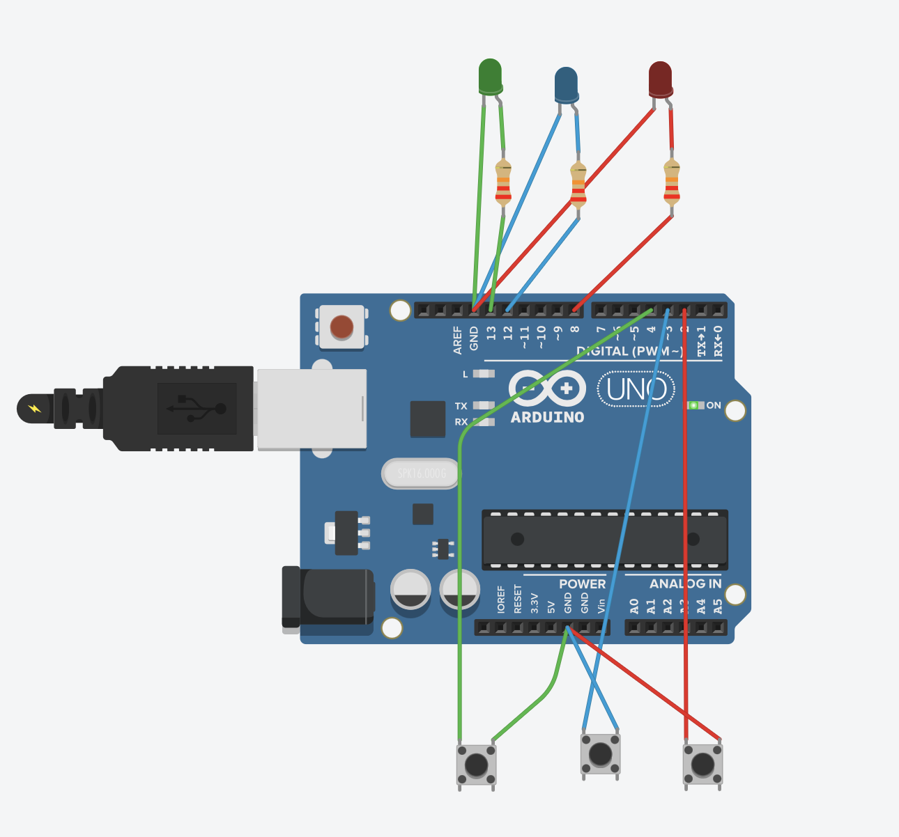

# Arduino LEDs and Push Buttons Project

## Overview
This project demonstrates the use of **inputs**, **processing**, and **outputs** using an Arduino Uno board.  
- **Inputs**: Three push buttons.
- **Processing**: Arduino Uno microcontroller.
- **Outputs**: Three LEDs (green, blue, and red).

Each push button controls a specific LED:
- **Left button** → Green LED
- **Middle button** → Blue LED
- **Right button** → Red LED

When a button is pressed, the Arduino detects the input and turns on the corresponding LED.

## Circuit Components
- Arduino Uno board
- 3 LEDs (green, blue, red)
- 3 Push buttons
- 3 Resistors for LEDs (220Ω)
- Jumper wires

## Pin Configuration
- **Green LED** → Pin 13
- **Blue LED** → Pin 12
- **Red LED** → Pin 8
- **Left Button** → Pin 4
- **Middle Button** → Pin 3
- **Right Button** → Pin 2

## How It Works
1. Each button is connected to a digital input pin.
2. When a button is pressed.
4. When the button is released, the LED turns OFF.

## Circuit Image

## Simulation Link
You can view and test the circuit in Tinkercad using the following link:  
[**Tinkercad Project Link**](https://www.tinkercad.com/things/aETMYQZEo46-arduino-project?sharecode=V4f2wsfzJp3EL8TmjLfHPw9Nnxt-lTawUafBOA7b8cE)

## Demonstration Video
A video showing the circuit in action can be found here:  
[**Google Drive Video**](https://drive.google.com/file/d/1WQ6RMIWD_KLoBi3o2uKAXUdECSb4yZPu/view?usp=sharing)

---
**Created by:** [Dala Khalid]  

